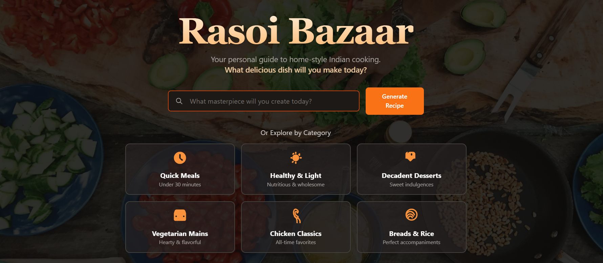

# 🍲 Rasoi Bazaar  




**Rasoi Bazaar** is a full-stack web app that helps you cook Indian dishes right at home.  
Pick any Indian cuisine you want — Rasoi Bazaar gives you everything you need: ingredients, basic equipment, and step-by-step instructions to follow along.  

👉 **Live Demo:** [rasoi-bazaar.vercel.app](http://rasoi-bazaar.vercel.app/)

---

## 🧩 Overview

Rasoi Bazaar is your digital kitchen companion for exploring Indian cuisine.  
It guides you through the entire cooking process — from finding a recipe to plating your dish.  
Each recipe comes with the full ingredient list, tools needed, and clear instructions anyone can follow.

The goal: make Indian cooking accessible, simple, and genuinely fun to do at home.

---

## 🧠 Features

- 🔎 **Explore Authentic Recipes** — Browse Indian dishes across regions and categories.  
- 🧾 **Step-by-Step Cooking Guide** — Follow clear, easy-to-understand instructions.  
- 🥣 **Ingredient Breakdown** — See what you need and in what quantity.  
- 🧰 **Equipment List** — Know the tools you'll need before you start.  
- 📱 **Responsive Design** — Works smoothly on desktop, tablet, and mobile.  
- 🌶️ **Real Indian Flavors** — Recipes curated for authenticity and taste.  

---

## ⚙️ Tech Stack

**Frontend:**  
- React.js  
- Next.js  
- Tailwind CSS  

**Backend:**  
- Node.js  
- Gemini API


**Deployment:**  
- Vercel

---

## 🚀 Getting Started

If you want to run Rasoi Bazaar locally, here’s how to set it up.

### 1. Clone the Repository
```bash
cd Desktop
git clone https://github.com/PranavKohli24/Rasoi-Bazaar.git
cd  Rasoi-Bazaar
````

### 2. Install Dependencies

```bash
npm install
```

### 3. Set Up Environment Variables

Create a `.env` file in the root directory and add the following:

```
GEMINI_API_KEY=your_api_key
```

Get your gemini api key from https://aistudio.google.com/api-keys
Then Create New API Key or use an existing one.

### 4. Start the Development Servers

Run the **Project**:

```bash
npm run dev
```


Now open [http://localhost:5173](http://localhost:5173) and you’re good to go.


---


## 🌱 Future Enhancements

* 👤 User accounts to save favorite recipes
* 🍛 Personalized recommendations
* 🔁 Ingredient substitution suggestions
* 📸 User-submitted recipes
* 🎥 Video tutorials for each dish

---

## 🤝 Contributing

Contributions are welcome!
To get started:

1. Fork the repo
2. Create a new branch (`feature/your-feature-name`)
3. Make your changes
4. Commit and push
5. Open a pull request

---

## 📬 Contact

**Pranav Kohli**
📧 [[hey@pranavkohli.me](mailto:hey@pranavkohli.me)]
---

## 🧡 Credits

Built with love for Indian food and web development.
Every recipe, every line of code — made to bring the flavors of India to your kitchen.

---


